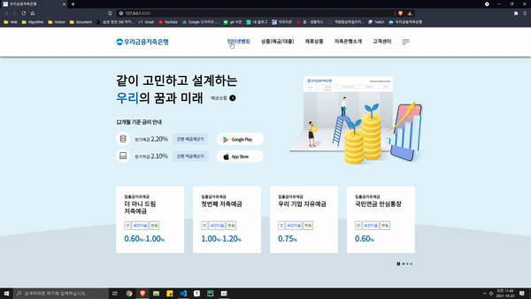

   
    
  <h1>우리은행 웹사이트</h1>
   

##  1. 개요

우리 은행 웹사이트 클론 코딩

> [참고 사이트](https://www.woorisavingsbank.com/main/main.do#none)

  

## 2. 기술 스택

-  

-  

-  

-  

-  

  

  

## 3.  라이브러리

##  

  

## 4. 주요 페이지

|                         메인 페이지                          |
| :----------------------------------------------------------: |
|  |